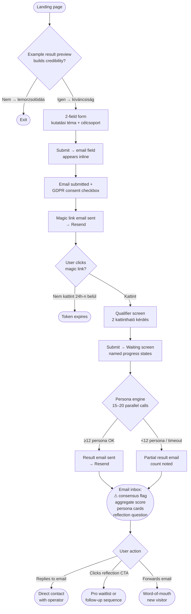
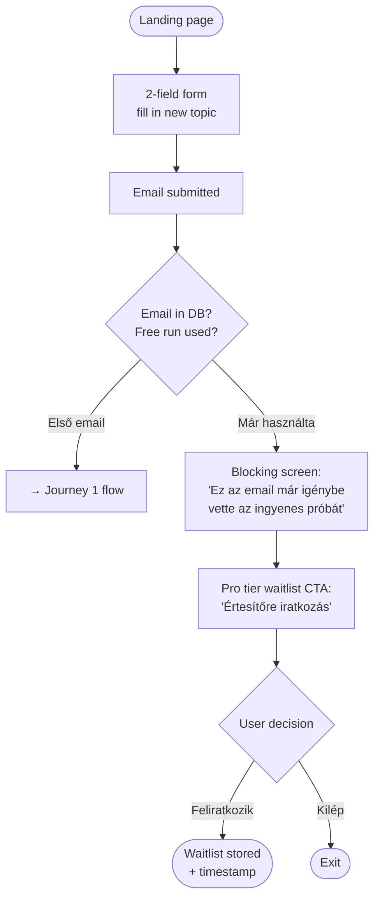
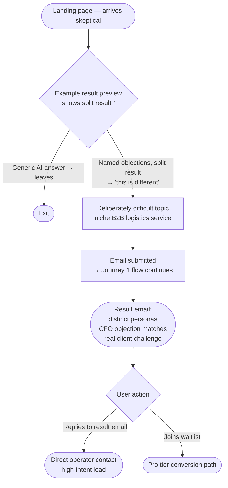

# UX Design Specification SwarmSense

**Author:** Balazs
**Date:** 2026-03-19

---

## Executive Summary

### Project Vision

SwarmSense is a synthetic market research platform that delivers a structured, multi-perspective simulation of market sentiment — 15–20 attitudinally distinct AI personas responding to a user's hypothesis — within 90 seconds of submission, delivered via email. The MVP is a lead-generation tool targeting Hungarian marketing, product, and agency professionals. Its core value proposition: the insight quality of a structured focus group at ~$0.002 per run, with no recruitment, no scheduling, and no waiting.

### Target Users

**Primary: Kata (34, Marketing Manager)**
Time-pressured marketer validating campaign messages and creative hypotheses. Not research-savvy, but deadline-driven. Comes via word-of-mouth or LinkedIn. Needs an instant "aha moment" that's shareable with her creative director.

**Secondary: Márton (41, Agency Owner)**
Skeptic who arrives already critical ("just ChatGPT"). Needs credible evidence of persona *diversity* — split results, named objections, specific conversion conditions — to change his mental model. Converts through evidence, not promises.

**Operator: Balazs (Founder/Admin)**
Monitors runs, qualifier data, email metrics, and API spend. Needs operational clarity — not a polished UI, but a functional, information-dense log view.

### Key Design Challenges

1. **Credibility in the first 5 seconds.** The landing page must overcome the "ChatGPT wrapper" skepticism before the user decides to leave. The example result preview carries this weight: it must show a split result with distinct, named personas — not a generic AI answer.

2. **The broken experience: web → email.** The user submits on the web, waits 90 seconds on a progress screen, then receives results in their inbox — not on screen. The waiting state must frame this transition so users understand the result will arrive by email, and don't assume the system broke.

3. **Email capture at peak curiosity.** The email is requested *before* results are shown. This is the highest-friction conversion point. The form positioning, microcopy, and flow must convert the curiosity hook into a submitted email address without triggering resistance.

4. **Qualifier questions must not feel like a barrier.** Two questions appear after magic link verification, before processing starts. If framed as "another step," users drop off. If framed as "this personalizes your analysis," they complete it in under 30 seconds.

### Design Opportunities

1. **The waiting screen as a dramatic moment.** "Running 18 personas..." is a unique, ownable UX pattern. Rather than a generic progress bar, visualizing the personas being generated and executed communicates the attitudinal framework itself — this *is* the product differentiator made visible.

2. **The result email as the "aha moment" canvas.** In MVP, the browser experience ends at the waiting screen. The result email is where the product value lands. The ⚠ bold consensus flag, persona cards with named stances and conversion conditions, and the closing reflection question must be designed with the same care as a premium in-app experience.

3. **The "already used" screen as a conversion moment.** The returning-user blocking experience is not a dead end — it is the primary organic conversion path to the Pro tier waitlist. Its tone, layout, and CTA are as important as the main conversion funnel.

## Core User Experience

### Defining Experience

The defining interaction of SwarmSense is the two-field submission: a research topic and a target audience description, followed by Submit. This single gesture is where the user commits their hypothesis to the system. Every UX decision flows from making this moment feel effortless, credible, and consequence-free — the user must feel "this is safe to try" before they've invested anything beyond curiosity.

The full experience arc: Submit → Email capture → Magic link → Qualifier → Wait → Email inbox. This arc crosses two contexts (browser → email client) and must feel like one coherent experience, not two disconnected interactions.

### Platform Strategy

Web-first, responsive (desktop primary, mobile magic-link click path). The target user accesses the product during working hours on a desktop browser; the magic link email may be opened on mobile. No native app in MVP or V2 scope. No offline functionality required — the product is a request-response system with asynchronous email delivery.

### Effortless Interactions

- **The 2-field form:** No account creation, no password, no pre-registration. The only thing between the user and submitting their hypothesis is two text fields and a button.
- **Magic link authentication:** One click in email → seamless continuation. Zero typing required for identity verification.
- **Qualifier questions:** Clickable selectors only (dropdown + radio buttons). Completable in under 30 seconds. No free-text required.
- **Email result:** The consensus flag and top objection are visible above the fold without scrolling. The user's "aha moment" arrives without friction.

### Critical Success Moments

| Moment | Required Feeling |
|---|---|
| Landing page — first 5 seconds | "This is not a ChatGPT wrapper. That 9–9 split result is real." |
| Email submission | "This is worth my email address. This is my result, not a newsletter signup." |
| Waiting screen | "It's working. I will receive an email soon." (not: "something broke") |
| Email open | "⚠ 15/18 rejected this — I didn't expect that. I need to show this to my creative director." |
| "Already used" blocking screen | "Pro tier — this is the next step, not a wall." |

### Experience Principles

1. **Submission before registration.** The user must feel the value of the product *before* being asked to identify themselves. The 2-field form captures the hypothesis first; the email is the key to unlock the result — not the price of entry to the form.

2. **Trust through specificity.** Every moment of potential skepticism ("is this just AI noise?") is answered with concrete, specific output: named personas, distinct stances, explicit conversion conditions. Generic language anywhere in the UI undermines the product's core claim.

3. **One experience across two contexts.** The browser and the inbox are one continuous journey. The waiting screen sets the expectation; the result email delivers on it. Microcopy, tone, and visual language must be consistent across both.

4. **Friction only where it serves the product.** The qualifier questions are the only intentional friction in the funnel — and they must earn their place by being framed as personalization ("this helps calibrate your personas"), not as a data extraction step.

## Desired Emotional Response

### Primary Emotional Goals

The primary emotional goal of SwarmSense is **earned surprise**: a concrete, unexpected insight that the user could not have reached alone. Not generic AI wonder, but a specific moment — "15/18 rejected my headline, and the CFO's objection is exactly the one I've been stuck on for weeks." This is the emotion that drives word-of-mouth, forwarded emails, and return intent.

Supporting emotional goal: **effortless confidence**. The product should make the user feel capable and informed — not overwhelmed by data or unsure what to do with the output. Every structural choice in the result (aggregate score, bold flag, named persona, reflection question) serves this goal.

### Emotional Journey Mapping

| Moment | Target Emotion | Emotion to Avoid |
|---|---|---|
| Landing page | Curiosity + immediate credibility | Skepticism → abandonment |
| Form completion | Lightness ("this is really this simple?") | Uncertainty ("what should I write here?") |
| Email capture | Trust ("this unlocks my result") | Resistance ("another data grab") |
| Magic link click | Continuity and seamlessness | Disorientation ("where did I end up?") |
| Qualifier questions | "This personalizes my analysis" | "Yet another step — when does this end?" |
| Waiting screen | Excitement and anticipation | Anxiety ("did it break? did it send?") |
| Email open | **Surprise + concrete insight** = the "aha moment" | Generic AI-answer feeling |
| "Already used" screen | Appreciation ("worth coming back") | Frustration, dead end |

### Micro-Emotions

- **Trust vs. Skepticism**: Determined on the landing page. The example result preview is the primary trust-building element — it must show a split result with named personas, not a polished marketing claim.
- **Surprise vs. Confirmation**: The result email must surprise the user with what they *need to know*, not confirm what they already believed. Unanimous results (15+/20) trigger a bold flag precisely because surprise has high emotional value.
- **Anticipation vs. Anxiety**: The waiting screen must sustain anticipation ("personas are running") rather than create anxiety ("is this broken?"). Specific persona counts ("Running 18 personas…") and clear email expectation-setting convert waiting into forward momentum.

### Design Implications

- **Trust → Show, don't claim.** The landing page copy never says "better than ChatGPT." The example result preview demonstrates it — a visible split, named personas, specific objections, conversion conditions. The product earns trust through evidence.
- **Surprise → Protect the unexpected.** The result email design must not bury the most surprising finding. The consensus alert (⚠ 15/18 rejected) goes above the fold, before persona cards. If the result surprises, it must be the first thing the user sees.
- **Anticipation → Name what's happening.** The waiting screen uses specific, active language ("Running 18 personas," "Composing your result") — not generic "Loading…" This makes the wait feel productive and maintains anticipation rather than anxiety.
- **Trust at email capture → Reframe the ask.** The email field is not a newsletter signup. Microcopy must frame it as: "Your result will be delivered to this address." The email is the delivery mechanism, not the price of entry.
- **Continuity → Match tone across browser and inbox.** The waiting screen and the result email share visual language, tone, and the same product name header. The user should feel they never left the experience when they open the email.

### Emotional Design Principles

1. **Earn the emotion, don't claim it.** No copy tells the user how to feel. Specific data, named personas, and unexpected results create the emotion; the design creates the conditions for it.
2. **Make the wait part of the experience.** The 90-second processing window is an asset, not a liability. Persona-count progress transforms it from friction into anticipation.
3. **Surprise is the product.** The result must contain at least one thing the user did not expect. If the design or the copy softens unexpected findings ("results may vary"), the core value proposition is undermined.
4. **Respect the user's skepticism.** Márton is always in the room. Every claim must be substantiated by visible evidence. Enthusiasm without specificity destroys trust with the exact users SwarmSense most needs to convert.

## UX Pattern Analysis & Inspiration

### Inspiring Products Analysis

**Typeform — Single-focus progressive form UX**
Typeform's contribution is not aesthetic — it is structural. One focal point per step, zero visual competition, persistent sense of forward progress. The 2-field submission form and the qualifier question step in SwarmSense share this challenge: users must feel each step is the only thing they need to do right now. Rotating example inputs (research topic + audience) serve a similar function to Typeform's placeholder progressions — they reduce the "what do I write?" cognitive load before the user has started.

**Stripe (onboarding and landing pages) — Abstract value made concrete**
Stripe solves the same problem SwarmSense has on the landing page: a technically sophisticated product that must communicate its value in 5 seconds to a skeptical audience. Stripe's answer is always a specific, visual artifact — a code snippet, a payment dashboard, a checkout flow — not a claim. SwarmSense's answer is the example result preview: a real split result with named personas, specific objections, and conversion conditions. Generic "AI research tool" copy is the anti-Stripe move.

**Loom (result delivery) — Value in the delivery, not behind a link**
Loom's result notification email contains a video thumbnail with the first frame visible — the value is partially delivered before the user clicks. SwarmSense's result email must follow this principle: the ⚠ consensus flag, the aggregate score, and the top objection belong in the email body, not behind a "view your results" CTA. The "aha moment" starts at email open, not after a click.

### Transferable UX Patterns

**Progressive disclosure (from Typeform):**
Surface one decision at a time. The funnel has five distinct moments (form → email → magic link → qualifier → wait → inbox). Each must feel like the only thing happening. No step should preview the next step's requirements.

**Concrete artifact over abstract claim (from Stripe):**
Every value proposition on the landing page is backed by a visible, specific example — not marketing language. The example result preview is the most critical UI element on the landing page; it does more persuasion work than any headline.

**Deliver value at the delivery moment (from Loom):**
The result email is not a notification — it is the product. The most impactful finding (consensus flag + top objection) must be above the fold, visible without scrolling, requiring no additional click. The reflection question at the end creates a natural closing interaction.

**Named progress states (from async processing UX patterns):**
Progress bars say nothing. Named states ("Generating personas," "Running 18 personas," "Composing your result") create anticipation and communicate the product's mechanism simultaneously. The waiting screen is a UX opportunity, not a loading screen.

### Anti-Patterns to Avoid

- **"Create an account to see your results."** Any pre-result registration wall destroys the curiosity hook. The magic link is the only identity moment before results are delivered.
- **Generic loading spinner.** A featureless progress bar on the waiting screen wastes 90 seconds of the user's most engaged attention. Named states + persona count must replace it.
- **Result behind a CTA click.** If the result email contains only a "View your SwarmSense analysis" button with no preview content, the email is a notification, not an experience. The value must be partially visible at open.
- **"You might also like..." CTAs in the result email.** The result email has one CTA: the reflection question response or the Pro waitlist. Adding cross-sell or upsell noise at the moment of highest value delivery undermines the "aha moment."
- **Free-text qualifier questions.** Open-ended questions at the qualifier step increase cognitive load and reduce completion rates. Radio buttons and dropdowns only — the qualifier is a data-collection step, not a conversation.

### Design Inspiration Strategy

**Adopt:**
- Single-focus progressive form structure (Typeform) — each step of the funnel is isolated
- Concrete artifact on landing page (Stripe) — the example result preview IS the value proposition
- Value-in-delivery email design (Loom) — consensus flag + top objection above the fold

**Adapt:**
- Typeform's visual minimalism → adapted for a research/data product aesthetic (slightly more information-dense than Typeform's consumer tone)
- Stripe's developer-facing specificity → adapted for a non-technical marketing audience (no jargon, persona names and stances over scores and percentages)

**Avoid:**
- Any pattern that delays the "aha moment" behind an additional click
- Any pattern that makes the waiting screen feel like a generic loading state
- Any form pattern that asks for more than what's needed at each step

## Design System Foundation

### Design System Choice

**Tailwind CSS + shadcn/ui**

shadcn/ui is not a traditional component library — components are copied directly into the project, making them fully owned and customizable. Built on Radix UI primitives, it provides accessibility compliance (WCAG 2.1 AA) out of the box. Tailwind CSS provides the utility-first styling layer that integrates natively with Next.js.

### Rationale for Selection

- **Speed:** Solo founder, 1–2 week build. shadcn/ui eliminates boilerplate for form inputs, dialogs, progress indicators, and button states without locking in opinionated visual defaults.
- **Customization:** Components live in the codebase, not in node_modules. Full visual control without overriding a framework's CSS specificity.
- **Accessibility:** Radix UI primitives handle keyboard navigation, ARIA attributes, and focus management — directly satisfying NFR20 (WCAG 2.1 AA for landing, form, and processing screens).
- **Brand fit:** Tailwind's utility classes enable a clean, data-forward visual language appropriate for a B2B research tool — distinct from consumer AI tools without requiring a custom design system investment.
- **Next.js native:** Zero configuration friction with the chosen frontend stack.

### Implementation Approach

- **Design tokens:** Define a small set of CSS custom properties (brand color, neutral scale, typography scale) in `globals.css` using Tailwind's `@layer base` — these cascade through all shadcn/ui components.
- **Component inventory:** Use only what's needed. Priority components: Button, Input, Textarea, Select, RadioGroup, Progress, Badge, Card, Separator.
- **Email styling:** shadcn/ui is browser-only. The result email uses inline CSS (compatible with email clients), sharing the same color tokens and typographic scale for visual continuity across browser and inbox.

### Customization Strategy

- **Color palette:** Dark, data-forward neutral base (slate/zinc scale) with a single accent color for CTAs and the consensus alert flag. Avoid the "AI startup blue" default.
- **Typography:** System font stack for performance (no web font loading delay on the conversion-critical form screen). Mono or tabular figures for persona count displays and sentiment scores.
- **The consensus alert (⚠ flag):** Custom styled Badge component — high contrast, bold weight, left-aligned above persona cards in both the waiting screen and result email.
- **Persona cards:** Custom Card variant with left-border accent color indicating stance (support/reject/conditional) — scannable at a glance without reading the full card.

## 2. Core User Experience

### 2.1 Defining Experience

**"Submit a hypothesis, receive a swarm."**

The user types what they believe — a campaign headline, a product positioning, a pricing angle — and within 90 seconds receives a structured simulation of how 15–20 distinct market voices respond to it. The defining interaction is not the form, not the wait, not the email — it is the moment the user reads a named persona's objection and thinks: *"I didn't expect that. I need to do something differently."*

Everything in the UX is designed to get the user to that moment as fast as possible, with as little friction as possible, and to make that moment land with maximum impact.

### 2.2 User Mental Model

**How users currently solve this problem:**
Marketing managers either skip validation entirely (intuition-based decisions) or wait for A/B test results post-launch (too late to course-correct). The mental model they bring: "I need a second opinion, but I don't have time or budget for research."

**What they expect SwarmSense to be:**
The skeptical first impression is "another AI that tells me what I want to hear." The product must immediately and visibly contradict this expectation — by showing a split result, named objections, and conversion conditions that a single LLM prompt cannot produce.

**Where they get confused:**
- "Why do I need to give my email before seeing results?" → Reframed by microcopy: the email *is* the delivery channel.
- "Did it work? I'm just staring at a loading screen." → Resolved by named progress states and explicit email expectation-setting on the waiting screen.
- "Is this real research or AI hallucination?" → Resolved by the interpretive disclaimer in every result email and the specificity of persona stances.

### 2.3 Success Criteria

The core interaction succeeds when:

1. The user reads the result email and identifies at least one finding they did not expect.
2. The user takes a concrete action in response: rewrites copy, shares the result, replies to the email, or joins the waitlist.
3. The user's dominant feeling is "I couldn't have gotten this from a single ChatGPT prompt."

**Proxy metric:** At least 70% of first-time verified users complete the post-result reflection action (reply-to email or tracked reflection CTA click) within 24 hours of result delivery.

### 2.4 Novel UX Patterns

SwarmSense combines two established patterns in an unusual way:

**Established: Async request-response (like email or Slack notifications)**
Users are familiar with "submit something, get a result in your inbox." The magic link email and the result email both use this familiar mental model.

**Novel: The waiting screen as a live window into parallel processing**
No existing consumer product shows "18 parallel AI agents running your query in real time" as a UI state. This is genuinely new, and it is the product's mechanism made visible. Named progress states ("Generating personas," "Running persona 14/18," "Composing your result") are not just UX comfort — they are the attitudinal framework communicating itself.

**Teaching strategy:** No tutorial needed. The waiting screen teaches the mechanism passively. The user learns what "swarm" means by watching it happen.

### 2.5 Experience Mechanics

**Initiation:**
The user arrives at the landing page. The example result preview below the fold shows a real split result. The headline above the fold states the value proposition. The 2-field form is the only CTA. Rotating placeholder examples in both fields reduce the "what do I write?" barrier.

**Interaction:**
1. User fills research topic + target audience → clicks Submit
2. Email field appears inline (no page reload) → user enters email
3. Magic link email sent → user clicks link → lands on qualifier screen
4. Two clickable qualifier questions (role + use case) → Submit
5. Waiting screen: named progress states + persona count + "your result will arrive by email" notice
6. Result email: ⚠ consensus flag → aggregate score → persona cards → reflection question → single CTA

**Feedback:**
- Form: inline validation, rotating examples as positive reinforcement
- Email capture: "We'll send your result to this address" — delivery frame, not consent frame
- Waiting screen: persona count increments ("Running 14 of 18 personas…") — visible progress
- Result email: the consensus flag is the primary feedback signal — it tells the user immediately whether the result is surprising or expected

**Completion:**
The experience completes when the user reads the reflection question at the bottom of the result email ("Mit tennél másképp ennek alapján?") and either replies or clicks the CTA. Completion is an action, not just a reading — the design must invite a response, not just deliver information.

## Visual Design Foundation

### Color System

**Base palette: Zinc/slate neutral scale (dark mode primary, light mode optional)**

The visual language is data-forward and sober — the result content is the visual hero, not decorative UI. A dark neutral base (zinc-900 background, zinc-800 surface, zinc-700 border) gives the product weight and seriousness appropriate for a B2B research tool, and differentiates it from the "bright AI startup" visual cliché.

**Accent: Amber/gold single accent**
One accent color handles all interactive and alert states. Amber communicates urgency and insight without alarm — appropriate for the consensus flag (⚠), primary CTAs, and active form states. It reads as "attention" rather than "error."

**Semantic color mapping:**

| Token | Value | Usage |
|---|---|---|
| `background` | zinc-950 | Page background |
| `surface` | zinc-900 | Card, form, email content background |
| `border` | zinc-800 | Dividers, card borders |
| `text-primary` | zinc-50 | Headings, labels |
| `text-secondary` | zinc-400 | Supporting text, disclaimers |
| `accent` | amber-400 | CTAs, consensus flag, active states |
| `stance-reject` | rose-400/border | Persona card left-border: rejection stance |
| `stance-support` | emerald-400/border | Persona card left-border: support stance |
| `stance-conditional` | amber-400/border | Persona card left-border: conditional stance |

**Accessibility:** All text/background combinations meet WCAG 2.1 AA contrast ratio (≥4.5:1 for body text, ≥3:1 for large text). Verified via Tailwind's color scale contrast values.

**Email compatibility:** The result email uses a white/light background (email client default) with the same accent color and stance border colors — maintaining visual continuity while ensuring rendering compatibility across email clients.

### Typography System

**Primary: System font stack**
No web font loading on the conversion-critical form and waiting screens. System fonts (SF Pro on macOS/iOS, Segoe UI on Windows, Roboto on Android/Linux) load instantly and feel native.

```css
font-family: -apple-system, BlinkMacSystemFont, 'Segoe UI', Roboto, sans-serif;
```

**Numeric displays: Tabular figures**
Persona counts ("14/18"), sentiment scores, and aggregate percentages use `font-variant-numeric: tabular-nums` — numbers align consistently in tables and progress displays.

**Type scale:**

| Role | Size | Weight | Usage |
|---|---|---|---|
| `hero` | 3xl–4xl | 700 | Landing page headline |
| `h2` | 2xl | 600 | Section headings |
| `h3` | lg | 600 | Card headings, persona names |
| `body` | base (16px) | 400 | Form labels, descriptions |
| `small` | sm (14px) | 400 | Disclaimers, metadata |
| `mono` | mono/sm | 400 | Persona counts, cost displays |

**Line height:** 1.6 for body text (readability in result email persona cards). 1.2 for headings.

### Spacing & Layout Foundation

**Base unit: 4px (Tailwind default)**
All spacing uses multiples of 4px. The landing page and form screens use generous vertical spacing (32–64px between sections) to maintain single-focus progressive disclosure. Persona cards use tighter internal spacing (12–16px) to allow multiple cards to be visible simultaneously.

**Layout structure:**
- **Landing page:** Single-column, max-width 640px, centered. No sidebar, no navigation. One CTA, one example result preview.
- **Form + qualifier screens:** Single-column, max-width 480px, centered. Full-screen focus.
- **Waiting screen:** Single-column, max-width 480px, centered. Progress indicator dominant.
- **"Already used" screen:** Single-column, max-width 480px, centered. Blocking message + single CTA.

**Grid:** No grid system needed for MVP — all screens are single-column flows.

**Component spacing:**
- Form fields: 24px gap between inputs
- Persona cards in email: 16px gap, left-border 4px accent
- Section breaks: 48px vertical padding

### Accessibility Considerations

- **WCAG 2.1 AA compliance** required for landing, form, and processing screens (NFR20)
- All form inputs have associated `<label>` elements (shadcn/ui default via Radix)
- Keyboard navigation: Tab order follows visual layout order; no focus traps except modal dialogs
- Focus indicators: Tailwind's `focus-visible` ring using accent color — visible on dark background
- Color is never the sole differentiator: persona stance uses both border color AND text label
- GDPR consent checkbox: explicit label, not pre-checked, keyboard accessible
- Error states: inline error text below field (not just color change) — satisfies WCAG 1.4.1

## Design Direction Decision

### Design Directions Explored

Six directions were evaluated: Dark Minimal (1), Light Professional (2), Split Layout (3), High Contrast Impact (4), Warm Editorial (5), Data Terminal (6). All directions applied the established zinc/amber color system and persona card patterns to the landing page, form, consensus flag, and example result preview.

### Chosen Direction

**Direction 4 — High Contrast Impact**

Pure black background (#000), large bold typography (44–56px headline, 800 weight), amber accent, oversized numeric displays for persona counts, blockquote-style top objection callout, and top-bordered persona cards in a 3-column grid.

### Design Rationale

- **Credibility through scale:** Large, confident typography communicates certainty — appropriate for a product whose core claim is "we give you the answer you didn't expect." Tentative, small-scale design would undermine the product's authority.
- **The big number earns attention:** The oversized "15 / 18 personas rejected" stat is the first visual element that lands in the example preview. Users grasp the result before reading any copy — this is the fastest possible path to credibility.
- **Black base = data is the hero:** Pure black (#000) ensures that every colored element (amber CTA, rose/emerald/amber persona borders, blockquote accent) carries maximum visual weight. Nothing competes with the data.
- **Márton-proof:** The high-contrast, no-decoration aesthetic signals "serious tool" rather than "AI toy" — directly addressing the skeptical agency-owner persona.

### Implementation Approach

- Landing page headline: 44px, weight 800, letter-spacing -1px, line-height 1.1
- CTA button: amber-400, black text, weight 800 — single dominant action per screen
- Example result preview: oversized stat block → blockquote top objection → 3-column persona grid
- Form layout: 2 textareas side-by-side with CTA aligned right (as shown in Direction 4 mockup)
- Waiting screen: single large persona counter as the dominant visual element
- Result email: adapts the high-contrast principles to white email background — bold flag, large score, left-bordered persona cards

## User Journey Flows

### Journey 1: First-Time Success (Primary Funnel)

**User:** Kata, 34, marketing manager — first visit, full conversion path.



**Critical UX decisions in this flow:**
- Email field appears **inline after Submit** (no page reload) — progressive disclosure, curiosity is at peak
- Qualifier screen framing: "Segíts kalibrálni a personákat" — not "answer these questions"
- Waiting screen must show email delivery expectation: "Az eredményed erre az emailre érkezik"
- Result email: consensus flag above fold, no scroll required to see the key finding

---

### Journey 2: Returning User — Blocked + Waitlist

**User:** Kata returns 2 weeks later with a new brief.



**Critical UX decisions:**
- Blocking message tone: informative, not punitive — "már igénybe vette" not "nem jogosult"
- Waitlist CTA is the **only action** on this screen — no confusion about what to do next
- No form re-fill required: email is already known, single CTA button

---

### Journey 3: Skeptic Converted (Márton)

**User:** Márton, 41, agency owner — arrives critical, converted by evidence on the landing page.



**Critical UX decisions:**
- The example result preview on the landing page **must show a split** — not a one-sided result. Named objections, specific conversion conditions. This is the single most important element for converting Márton.
- The reply-to address on result emails enables high-value direct contact — must be a real, monitored address.

---

### Journey Patterns

**Progressive email disclosure:**
The email field never appears at page load. It appears only after the user has committed to a topic and audience — at the moment of maximum curiosity and minimum resistance.

**Single-action screens:**
Each screen in the funnel has exactly one primary action. The form has Submit. The qualifier has Submit. The waiting screen has no action (passive). The blocking screen has one CTA. No screen presents competing choices.

**Expectation bridging (browser → inbox):**
The waiting screen explicitly states where the result is going ("Az eredményed erre az emailre érkezik: kata@..."). This bridge prevents the user from assuming the experience ends at the waiting screen.

**Error states as transparent signals:**
Partial results (12–14 personas) are delivered with the count noted ("17/18 persona válaszolt"). No silent degradation. The user sees exactly what happened — this maintains trust even in edge cases.

### Flow Optimization Principles

1. **Curiosity before commitment.** The user invests in the product (types topic + audience) before being asked to identify themselves. Every step that requests personal data comes after demonstrated value.
2. **Named states over generic loading.** "Running 14 of 18 personas…" > "Loading…" at every async point in the funnel.
3. **Email as delivery, not paywall.** All email capture microcopy frames email as the result delivery channel, not a registration requirement.
4. **One exit, one CTA per screen.** No screen offers competing actions. The only decision per screen is: proceed or leave.

## Component Strategy

### Design System Components

The following shadcn/ui components are used as-is or with minor token customization:

| Component | Usage |
|---|---|
| `Button` | Primary CTA (Submit, waitlist signup), inline email submit |
| `Input` | Email capture field |
| `Textarea` | Research topic + target audience fields |
| `Select` | Qualifier question — role dropdown |
| `RadioGroup` | Qualifier question — use case selection |
| `Progress` | Waiting screen persona count bar (visual variant) |
| `Badge` | Consensus alert flag (⚠ 15/18 rejected) |
| `Checkbox` | GDPR consent at email capture |
| `Separator` | Section dividers on landing page |

### Custom Components

#### ConsensusFlag

**Purpose:** Display the primary result signal — whether persona responses converged on rejection or support, and at what threshold.
**Usage:** Top of result email and waiting screen completion state. Triggered when ≥15/20 personas align.
**Anatomy:** Icon (⚠) + bold count text ("15/18 persona elutasítja") + optional sub-line
**States:** `strong-reject` (rose), `strong-support` (emerald), `split` (hidden — flag not shown for balanced results)
**Accessibility:** `role="alert"`, `aria-live="assertive"` — screen readers announce the flag when it appears

#### PersonaCard

**Purpose:** Display a single persona's stance, primary argument, and condition for changing their mind.
**Usage:** Result email (3-column grid on desktop, single-column on mobile), example result preview on landing page.
**Anatomy:** Left border (4px, stance color) + persona name + role + stance label + argument text + optional "condition for changing mind" section
**States:** `reject` (rose border), `support` (emerald border), `conditional` (amber border)
**Variants:** `compact` (landing page preview, truncated text) / `full` (result email, full argument)
**Accessibility:** `aria-label="[persona name], [stance]"` on card container

#### WaitingScreen

**Purpose:** Sustain anticipation during 90-second processing; bridge browser→inbox context.
**Usage:** After qualifier submission, replaces qualifier screen.
**Anatomy:** Named progress state label + persona count ("Running 14 of 18 personas…") + large numeric counter + email delivery notice + delayed notice if >120s
**States:** `queued` → `generating` → `running` (with count) → `composing` → `completed`
**Accessibility:** `aria-live="polite"` on progress label; progress bar has `role="progressbar"` with `aria-valuenow`

#### RotatingPlaceholder

**Purpose:** Reduce "what do I write?" cognitive load on form fields by cycling through example inputs.
**Usage:** Research topic textarea + target audience textarea on landing page form.
**Anatomy:** Textarea with animated placeholder text cycling every 4 seconds
**States:** `idle` (cycling) / `focused` (stops cycling) / `filled` (no placeholder)
**Accessibility:** Placeholder text is supplemental — label is the accessible name; cycling does not affect screen readers

#### BlockingScreen

**Purpose:** Inform returning users that their free run has been used; convert to Pro waitlist.
**Usage:** Replaces form after email DB check returns "already used."
**Anatomy:** Informative headline + explanation + Pro waitlist CTA button + optional "learn more" link
**States:** `default` / `waitlist-submitted` (CTA replaced with confirmation message)
**Accessibility:** `role="main"`, heading hierarchy maintained; CTA is a `<button>` not a link

### Component Implementation Strategy

- All custom components are built as React components in `/components/ui/` alongside shadcn/ui components
- Custom components use the same Tailwind design tokens (zinc scale, amber accent, rose/emerald stance colors)
- Email variants of PersonaCard and ConsensusFlag use inline CSS for email client compatibility, sharing color values via a shared tokens file
- No component fetches data — all are pure display components receiving props from page-level logic

### Implementation Roadmap

**Phase 1 — MVP critical path:**
`ConsensusFlag`, `PersonaCard`, `WaitingScreen`, `RotatingPlaceholder`, `BlockingScreen`

**Phase 2 — V2 additions:**
`TokenBalance`, `RunHistoryRow`, `PurchaseTierCard`

**Phase 3 — V3 additions:**
`ResultsChart`, `HypothesisCard`, `TeamSeatRow`

## UX Consistency Patterns

### Button Hierarchy

**Primary — amber-400, black text, weight 800:** One per screen. Submit, "Elemzés indítása", "Feliratkozás". Never two primary buttons on the same screen.

**Secondary — transparent, zinc border:** Used only for supplemental actions (learn more). Not used in primary funnel.

**Link-style — amber text, no border:** Privacy Policy, Terms of Service, unsubscribe. Opens in new tab for legal documents.

**Disabled state:** 50% opacity, `cursor-not-allowed`, `aria-disabled="true"`. Applied to Submit before required fields are filled.

---

### Form Patterns

**Labels:** Always above the field, always visible. Never placeholder-only.

**Required field indicator:** Asterisk (*) + screen-reader-only note. No inline "required" text cluttering layout.

**Validation — on blur, not on keystroke:**
- Error: red border + inline error text below field
- Success: silence — no visual indicator needed in a minimal 2-field form

**Rotating placeholder:** Cycles every 4 seconds, stops on focus, does not restart after user clears and blurs.

**GDPR checkbox:** Never pre-checked. Explicit label with inline links to Privacy Policy and Terms of Service. Submit disabled until checked.

---

### Feedback Patterns

**Success:** Waiting screen IS the success state. No toasts or banners.

**System error — full screen:** Clear explanation + single recovery action (e.g. "Új link kérése" for expired magic link).

**Partial result:** Delivered transparently with count noted ("17/18 persona válaszolt") — not framed as error.

**Warning:** PII warning below research topic field — static, not dismissible.

**Info:** Interpretive disclaimer in result email — gray, bottom of email, present but not dominant.

---

### Navigation Patterns

No navigation in MVP. No header nav, sidebar, or breadcrumbs.

Only navigation elements: Privacy Policy + Terms of Service links (landing page footer + email capture step), unsubscribe link (every marketing email footer).

---

### Loading & Empty States

**WaitingScreen:** Named progress states with persona counter — first-class UI moment, not a generic spinner.

**Magic link sent:** Static confirmation only. No polling.

**Empty states:** Not applicable in MVP — no lists or dashboards.

---

### Microcopy Patterns

| Context | ✅ Use | ❌ Avoid |
|---|---|---|
| Email capture | "Az eredményed erre az emailre érkezik" | "Regisztrálj az eredmény megtekintéséhez" |
| Waiting screen | "Futtatás: 14/18 persona" | "Betöltés…" / "Kérjük várjon" |
| Blocking screen | "Ez az emailcím már igénybe vette az ingyenes próbát" | "Nem jogosult" / "Próba lejárt" |
| Result email CTA | "Mit tennél másképp ennek alapján?" | "Kattints ide az eredmény megtekintéséhez" |

## Responsive Design & Accessibility

### Responsive Strategy

**Desktop (1024px+) — primary design target:**
Single-column, max-width 640px, centered. No sidebars or multi-column layouts — intentional. The narrow column on a wide screen creates deliberateness and reduces distraction. Example result preview expands to max-width 720px on large screens.

**Tablet (768px–1023px):**
Same single-column layout as desktop. Tap targets minimum 44×44px on all interactive elements.

**Mobile (320px–767px):**
- Headline reduces to 28px (from 44px desktop)
- Form textareas stack vertically (side-by-side layout collapses)
- PersonaCard grid: 3-column → 1-column
- Qualifier RadioGroup: full-width items, 48px height minimum
- Magic link email (opened on mobile in majority of cases): single column, 16px minimum font, 44px CTA button minimum

### Breakpoint Strategy

Tailwind standard breakpoints, mobile-first:

| Breakpoint | Width | Usage |
|---|---|---|
| `sm` | 640px | Landing page max-width container |
| `md` | 768px | PersonaCard grid: 1-col → 2-col |
| `lg` | 1024px | PersonaCard grid: 2-col → 3-col |

### Accessibility Strategy

**Target: WCAG 2.1 AA** (required by NFR20 for landing, form, and processing screens)

**Color contrast (verified):**
- Primary text zinc-50 on zinc-950: ~17:1 ✅
- Secondary text zinc-400 on zinc-950: ~5.8:1 ✅
- Amber CTA (black on amber-400): ~8.9:1 ✅
- Stance labels rose-400 on zinc-900: ~4.6:1 ✅

**Keyboard navigation:** All elements Tab-reachable. Form submit via Enter. RadioGroup via arrow keys (Radix default). No keyboard traps. Focus ring: `focus-visible:ring-2 focus-visible:ring-amber-400`.

**Screen reader:** All inputs have `<label>`. ConsensusFlag uses `role="alert"`. WaitingScreen uses `aria-live="polite"` + `role="progressbar"`. Persona stance: color AND text label (never color-only).

**Touch targets:** Minimum 44×44px all interactive elements. Qualifier items 48px on mobile.

**Motion:** RotatingPlaceholder respects `prefers-reduced-motion` — stops cycling. No autoplay, no parallax.

### Testing Strategy

**Automated (CI/CD):** axe-core on each build (zero critical violations gate). Lighthouse accessibility ≥90 on landing page.

**Manual pre-launch:** Keyboard-only full funnel navigation. VoiceOver (macOS/iOS) on landing + qualifier. Mobile browsers: Safari iOS + Chrome Android on physical devices. Email rendering: Gmail (web + mobile), Apple Mail, Outlook 2019.

### Implementation Guidelines

**Responsive:**
- `max-w-lg` (512px) for form screens, `max-w-2xl` (672px) for landing
- `mx-auto px-4 sm:px-6` for horizontal padding
- PersonaCard: `grid-cols-1 md:grid-cols-2 lg:grid-cols-3`
- Form layout: `flex flex-col md:flex-row gap-3`

**Accessibility:**
- shadcn/ui + Radix handles ARIA and keyboard by default — do not override
- Always `<button>` not `<div onClick>`
- Email: `role="presentation"` on layout tables, all images have `alt`
- `<html lang="hu">` on all pages
