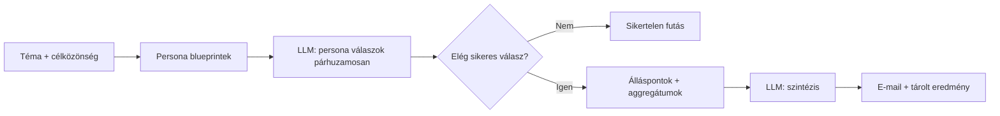

# SwarmSense — termékáttekintés és a kutatási eredmény felépítése

Ez az összefoglaló röviden bemutatja, mi a SwarmSense, kinek szól, milyen problémára ad választ, és **lépésről lépésre**, hogyan áll össze egy futtatás kutatási eredménye a rendszerben.

---

## Mi ez a termék?

A **SwarmSense** egy **szintetikus piackutatási** eszköz: a felhasználó megad egy **kutatási kérdést** (hipotézist) és egy **célközönség-leírást**, a rendszer pedig **több, egymástól függetlenül „szimulált” döntési szereplő** (persona) nézőpontjából gyűjt véleményeket, majd ezekből **összesített elemzést** készít.

Az eredményt tipikusan **e-mailben** kapja meg a felhasználó; a folyamat közben a webes felület **futásállapotot** mutat (hány szereplő futott le).

**Fontos megkülönböztetés:** az output **nem valós emberek felmérése**, hanem **nagy nyelvi modellek (LLM)** által generált, a megadott közönséghez illeszkedő **szimuláció**. Érdemi üzleti vagy termék döntéshez mindig érdemes valós validációt is tervezni.

---

## Kinek szól?

- **Termék-, marketing- és growth szereplőknek**, akik gyorsan szeretnének **iránymutatást** arról, hogyan „csenghet” egy üzenet, árazás vagy ötlet egy adott közönségnél.
- **Induló és közepes csapatoknak**, akiknek nincs budgetjük klasszikus ügynökségi kutatásra vagy hosszú fieldworkre.
- **Bárkinek**, aki **hipotézist** akar tesztelni (B2B vagy B2C témában egyaránt): a célközönség leírása határozza meg, milyen „profilú” szereplők fognak válaszolni.

A landing üzenet szerint a termék a **lassú, drága, nehezen hozzáférhető** klasszikus piackutatással szemben a **percek alatti, megfizethető** irányt kínálja.

---

## Milyen problémát old meg?

| Gyakori fájdalom | Mit ad a SwarmSense |
|------------------|---------------------|
| A valós kutatás **hetekig–hónapokig** tart | Egy futtatás **percek** alatt lezajlik (a komplexitástól függően) |
| **Ügynökségi költség** és szervezés | Önkiszolgáló folyamat, **megfizethető** modell |
| „Mit szólna ehhez a piac?” — **nincs gyors válasz** | Több, változatos **nézőpont** + **összefoglaló és stratégiai réteg** egy csomagban |

A termék **nem** helyettesíti a reprezentatív mintavételt, fókuszcsoportokat vagy 1:1 interjúkat; **gyors irányjelzőként** és **ötleteléshez** optimális.

---

## Milyen kontextusokat kap a program futás közben? (LLM-promptok)

Egy tipikus futtatás **három különböző típusú** nagy nyelvi modell-hívást végez el a backend (`backend/app/services/`): először **persona-blueprintek** generálása, majd **personánkénti vélemények**, végül egy **összesítő szintézis**. Mindegyik lépéshez tartozik egy **rendszerprompt** (system) és egy **felhasználói prompt** (user), amelybe a felhasználó által megadott **kutatási téma** és **célközönség** beépül, illetve — a persona-lépésnél — a **konkrét személyiségparaméterek** és egy rövid **magyar piaci keret**.

Az alábbi szövegek a kódban lévő konstansokból és prompt-építő függvényekből származnak; ha a kód változik, ezt a szakaszt érdemes frissíteni.

### 1. Persona-blueprintek generálása (`blueprint_generator.py`)

| Réteg | Tartalom |
|--------|-----------|
| **Rendszerprompt** | A modell „tapasztalt kutatási szakértő”, aki **szintetikus persona profilokat** készít; **kizárólag magyar nyelven** válaszol; a válasz **JSON** legyen a kért kulcsokkal. |
| **Felhasználói prompt** | Beilleszti a **kutatási témát**, a **célközönséget**, a kért **személyek számát**; utasítja, hogy annyi **különböző**, a közönséget hitelesen reprezentáló személyt generáljon, **változatos attitűddel** (konzervatív/progresszív, szkeptikus/lelkes stb.); megadja a JSON szerkezetét (`personas` tömb); felsorolja a mezőket: `name`, `role`, `risk_appetite`, `decision_style`, `organizational_role`, `price_sensitivity`, `technology_adoption_curve`; rövid **szabályokat** a névhez, szerepkörhöz és az értékkészletekhez; jelzi, hogy a mezők értelmezése a **célközönség kontextusához** igazodjon (pl. kockázat jelentése vállalkozónál vs. kutatónál). |

**Megjegyzés:** ehhez a lépéshez **nincs** külön `HUNGARIAN_MARKET_CONTEXT` konstans beépítve — a „magyar” és kulturális illeszkedés a rendszerpromptból és a célközönség szövegéből, illetve a prompt szabályaiból következik.

### 2. Personánkénti vélemény (`persona_engine.py`)

| Réteg | Tartalom |
|--------|-----------|
| **Rendszerprompt (`HUNGARIAN_SYSTEM_PROMPT`)** | *„Te egy magyar piacismerettel rendelkező stratégiai személyiség vagy. Kizárólag magyar nyelven válaszolj. A válasz legyen pontos JSON objektum a kért kulcsokkal, extra mezők nélkül.”* |
| **Piaci keret (`HUNGARIAN_MARKET_CONTEXT`)** | A felhasználói promptban **„Piaci keret:”** címkével kerül be: *„Fókuszálj magyarországi vállalati valóságra, helyi vásárlói viselkedésre, magyar piaci sajátosságokra, és magyar üzleti nyelvezetre.”* |
| **Felhasználói prompt** | Utasítás vélemény készítésére a kutatási kérdésről a megadott **személyiség nézetéből**; beilleszti a **kutatási témát** és a **célközönséget**; felsorolja a **blueprint mezőit** (név, szervezeti szerep, döntő szerep, kockázatvállalás, döntési stílus, árérzékenység, technológiai adoptációs görbe); hozzáadja a fenti **Piaci keret** mondatot; megadja a válasz **JSON kulcsait** (`name`, `role`, `stance`, `primary_argument`, `change_condition`, `core_concern`, `buying_trigger`), az **álláspont** engedélyezett értékeit (`support` \| `reject` \| `conditional`), és a **szöveges mezők hosszúsági szabályait** (egy-egy lezárt mondat, max. 25 szó). |

### 3. Összesítő szintézis (`synthesis_service.py`)

| Réteg | Tartalom |
|--------|-----------|
| **Rendszerprompt (`SYNTHESIS_SYSTEM_PROMPT`)** | *„Te egy tapasztalt magyar üzleti stratega vagy. Kizarólag magyar nyelven válaszolj. A válasz legyen pontos JSON objektum a kért kulcsokkal, extra mezők nélkül.”* (A kódban szándékosan vagy elírás: „Kizarólag”.) |
| **Felhasználói prompt** | Fejléc: **„Szintetikus piackutatás persona-összesítő”**; ismét beilleszti a **kutatási témát** és a **célközönséget**; **listaként** összefoglalja az összes sikeres persona válaszát (név, szerep, álláspont, érv, aggodalom, trigger); utasítja az **ismétlődő minták** elemzésére; megadja a kimeneti JSON mezőket (`summary`, `main_barriers`, `winning_conditions`, `best_target_segment`, `strategic_recommendation`) és a **formátumi szabályokat** (összefoglaló hossza, 3 akadály, mondatonkénti max. szószám stb.). |

**Összefoglalva:** futás közben a modellek **mindig** megkapják a **témát** és a **célközönséget**; a **persona-hívások** pluszban a **szereplő-specifikus paramétereket** és az egy mondatos **magyar piaci keretet**; a **szintézis** az összes **összecsomagolt persona-visszajelzést** és szintézis-formátum-szabályokat. Külön **ország- vagy vertikális** konfigurációs réteg (pl. B2B/B2C váltó) a jelenlegi kódban **nincs** — azt a felhasználói szövegek és a fenti promptok együttesen határozzák meg.

---

## Hogyan áll össze a kutatási eredmény? (részletes folyamat)

Az alábbi lépések a backend feldolgozási logikához igazodnak (`process_run` → persona motor → szintézis → e-mail).

### 1. Bemenet: téma és közönség

A felhasználó által megadott:

- **Kutatási téma** (mit vizsgálsz — hipotézis, üzenet, árazási kérdés stb.)
- **Célközönség** (kinek szól — rövid leírás)

Ezek minden további lépésben **kontextusként** szerepelnek.

### 2. Persona-blueprintek generálása

A rendszer **több (alapértelmezetten 18)** különböző **persona-profilt** hoz létre, amelyek a megadott célközönséghez illeszkednek. A generálás célja, hogy a szereplők **attitűdben és háttérben változatosak** legyenek (pl. szkeptikus / lelkes, kockázatkerülő / merész), így az összkép kevésbé lesz egyoldalú.

### 3. Futás: egy-egy persona „válasza”

Minden blueprintre külön lefut egy **LLM-hívás**: a modell a megadott személyiségparaméterek (kockázatvállalás, döntési stílus, árérzékenység, tech-adopció stb.) és a **magyar piaci kontextus** szerint ad választ a kutatási kérdésre.

Egy sikeres persona-válasz tipikusan tartalmazza:

| Mező | Jelentés |
|------|-----------|
| **Álláspont (`stance`)** | `support` (támogatja) · `reject` (elutasítja) · `conditional` (feltételes) |
| **Elsődleges érv** | Mi a fő indok a vélemény mögött |
| **Mi változtatná meg a véleményt** | Milyen feltétellel módosulna az álláspont |
| **Mélyebb aggodalom** | Mi a mögöttes félelem / kockázat |
| **Vásárlási trigger** | Mi lenne az elfogadás felé billentő tényező |

A futások **párhuzamosan** is futhatnak (korlátozott egyidejűséggel), közben a rendszer **számlálja** a lefutott sikeres personákat.

### 4. Minőségi küszöb és státusz

- Ha a sikeresen lefutott personák száma **egy alsó küszöb (pl. 12)** alá esik, a futás **sikertelennek** minősül — eredmény e-mail nem megy, a felhasználó hibaállapotot lát.
- Ha **minden** persona lefutott → **`completed`** státusz.
- Ha **nem mind** futott le hibamentesen, de a küszöb fölött van a sikeres szám → **`partial`** (részleges eredmény).

### 5. Összeállítás („composing”): szintézis

Amikor megvannak a persona-válaszok, egy **külön LLM-hívás** készít **összesítő szintézist** az összes visszajelzésből. A szintézis tipikusan ezekből épül fel:

| Elem | Tartalom |
|------|-----------|
| **Összefoglaló** | 2–3 mondat a fő mintákról és jelzésekről |
| **Fő akadályok** | 3 rövid pont — mi gátolja az elfogadást |
| **Nyerési / sikerfeltételek** | Mi kellene a szélesebb egyetértéshez |
| **Legjobb célszegmens** | Melyik típusú szereplő a legreceptívebb |
| **Stratégiai ajánlás** | Konkrét következő lépés javaslat |

Ha a szintézis generálása elbukik, a futás ettől még lezáródhat; a szintézis mezők ilyenkor üresek maradhatnak.

### 6. Aggregátumok és „konszenzus” jelzés

A rendszer kiszámolja:

- **Álláspontonkénti darabszámok** (hány támogat / elutasít / feltételes)
- Opcionálisan egy **konszenzus-jellegű** jelzést: ha valamelyik álláspont **elég nagy többséget** kap egy küszöbhöz képest, az megjelenik összefoglalóként (pl. „erős támogatás irány”)

Emellett kigyűjthetők a **leggyakoribb érvek** az elsődleges érvek közül (top lista).

### 7. Eredmény kézbesítése

- A fenti adatokból összeáll egy **eredmény-payload** (téma, közönség, persona-sorok, szintézis, aggregátumok).
- **E-mail** formájában kerül kiküldésre (HTML), személyenkénti blokkokkal és szintézis-szekcióval.
- A **futtatás rekordja** az adatbázisban tárolja a státuszt, a lefutott personák számát, az álláspont-számlálókat és a szintézis mezőket, hogy később (pl. follow-up levelekben) is felhasználható legyen.

---

## Összefoglaló ábra (logikai folyamat)

---

## További olvasmány a repóban

- Minta kimenet felépítése: `docs/analysis-sample.md`
- Adattörlés / üzemeltetés: `docs/data-deletion-operations.md`, `docs/followup-cron-operations.md`

---

*Utolsó frissítés: a dokumentum a kódbázis jelenlegi viselkedéséhez igazítva készült; konkrét küszöbök és számok a backend konstansokban és migrációkban találhatók.*
